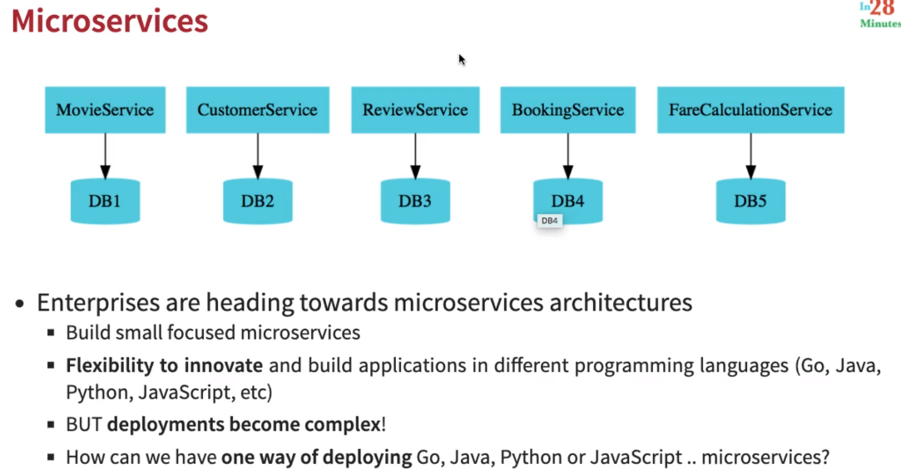
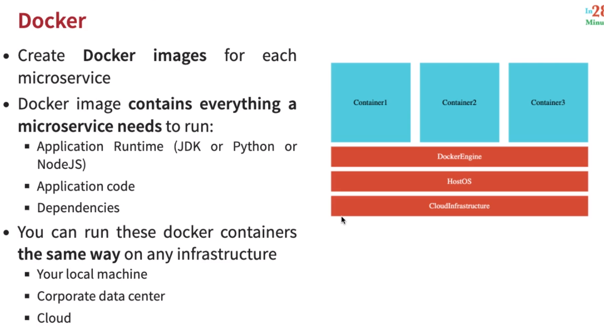
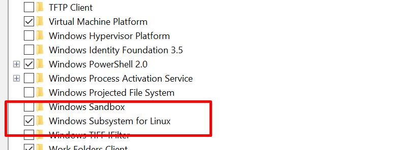
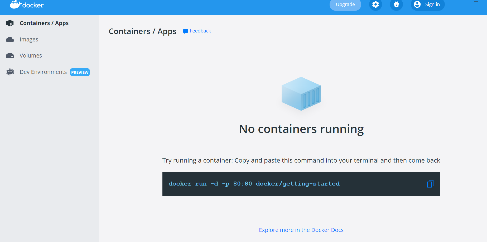

# Spring Microservices with Docker

## What You Will Learn during this Step 00:
- Docker overview

---

## How to install docker into Windows

1. Download docker from https://docs.docker.com/desktop/windows/install/
2. Follow the steps for install
3. Check virtualizatoin must be enabled

4. Go to Windows Features  --> enabled Hper-v and windows sub sytems for Linux

5. Excute below commands

   1. Open PowerShell/CMD as administrator 
   2. Run the command: bcdedit /set hypervisorlaunchtype auto
   3. dism.exe /Online /Enable-Feature:Microsoft-Hyper-V /All
   4. Restart your computer

6. 

---

