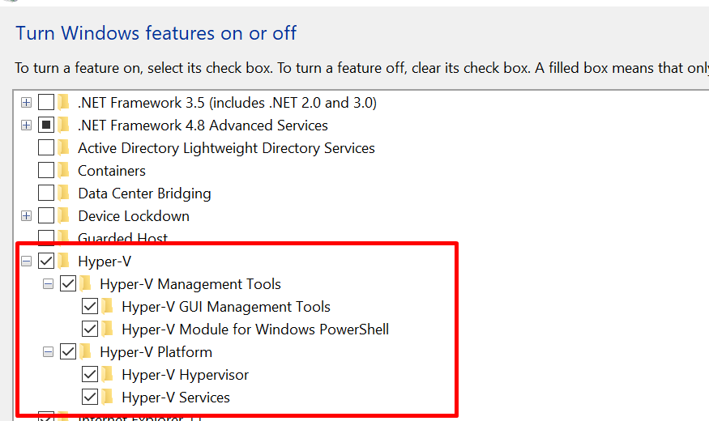

# Spring Microservices with Docker

## What You Will Learn during this Step 00:
- Docker overview

### Docker overview and installatio on windows10
https://github.com/jdbirla/jd-docker-crash-course/blob/master/Getting_Started_with_Docker.md


---
## What You Will Learn during this Step 01:
- Installing Docker - Docker

## How to install docker into Windows

1. Download docker from https://docs.docker.com/desktop/windows/install/
2. Follow the steps for install
3. Check virtualizatoin must be enabled


4. Go to Windows Features  --> enabled Hper-v and windows sub sytems for Linux




5. Excute below commands
  
   ```sh
   1. Open PowerShell/CMD as administrator 
   2. Run the command: bcdedit /set hypervisorlaunchtype auto
   3. dism.exe /Online /Enable-Feature:Microsoft-Hyper-V /All
   4. Restart your computer
   ```

6. Docker is running


```sh
Windows PowerShell
Copyright (C) Microsoft Corporation. All rights reserved.

Try the new cross-platform PowerShell https://aka.ms/pscore6

PS C:\WINDOWS\system32> docker --version
Docker version 20.10.14, build a224086
PS C:\WINDOWS\system32>
```

```sh
RECOMMENDATION : Use PowerShell in Windows!
Recommendation 1

If you are using Windows, make sure that you use PowerShell instead of Command Prompt.


Recommendation 2

If you are using Window 10 and are using docker toolbox

=> Use 192.168.99.100 instead of localhost.

Note: If 192.168.99.100 does not work, you can find the IP by using the command docker-machine ip


Reason

In Window 10 when using docker toolbox, docker is configured to use the default machine with IP 192.168.99.100


```

---

## What You Will Learn during this Step 02:
- Your First Docker Usecase - Deploy a Spring Boot Application

---
## What You Will Learn during this Step 03:
- Important Docker Concepts - Registry, Repository, Tag, Image and Container
```
user@DESKTOP-AS2FQOH MINGW64 /c/D_Drive/DXC/Learning/Projects/JD_Spring_Microservices (master)
$ docker run -p 5000:5000 in28min/todo-rest-api-h2:1.0.0.RELEASE

```
---
## What You Will Learn during this Step 04:
- Playing with Docker Images and Containers

---
## What You Will Learn during this Step 05:
- Understanding Docker Architecture - Docker Client, Docker Engine

---
## What You Will Learn during this Step 06:
- Why is Docker Popular

---
## What You Will Learn during this Step 07:
- Playing with Docker Images

---
## What You Will Learn during this Step 08:
- Playing with Docker Containers

--- 
## What You Will Learn during this Step 09:
- Playing with Docker Commands - stats, system

--- 
## What You Will Learn during this Step 10:
- Introduction to Distributed Tracing


---
## What You Will Learn during this Step 11:
- Launching Zipkin Container using Docker

```

user@DESKTOP-AS2FQOH MINGW64 /c/D_Drive/DXC/Learning/Projects/JD_Spring_Microservices (master)
$ docker run -p 9411:9411 openzipkin/zipkin:2.23
Unable to find image 'openzipkin/zipkin:2.23' locally
2.23: Pulling from openzipkin/zipkin
Digest: sha256:b3435e485f1e73266dba48ae56814c6731ffb76563a0b809456876f29a575f6b
Status: Downloaded newer image for openzipkin/zipkin:2.23

```


---

## What You Will Learn during this Step 12:

- Connecting Currency Exchange Microservice with Zipkin


### /currency-exchange-service/pom.xml
```xml
<dependency>
			<groupId>org.springframework.cloud</groupId>
			<artifactId>spring-cloud-starter-sleuth</artifactId>
		</dependency>

		<dependency>
			<groupId>org.springframework.cloud</groupId>
			<artifactId>spring-cloud-sleuth-zipkin</artifactId>
		</dependency>

		<dependency>
			<groupId>org.springframework.amqp</groupId>
			<artifactId>spring-rabbit</artifactId>
		</dependency>
```
* /currency-exchange-service/src/main/resources/application.properties

```properties
spring.sleuth.sampler.probability=1.0

```

* com.jd.microservices.currencyexchangeservice.CurrencyExchangeController
```
	private Logger logger = LoggerFactory.getLogger(CurrencyExchangeController.class);
	logger.info("retrieveExchangeValue called with {} {}", from ,to);

```
* Console output
```
trace id: 53cb1a88ac9f70fc
2022-05-14 06:46:23.670  INFO [currency-exchange,53cb1a88ac9f70fc,53cb1a88ac9f70fc] 4028 --- [nio-8000-exec-1] c.j.m.c.CurrencyExchangeController       : retrieveExchangeValue called with USD INR
```


---

## What You Will Learn during this Step 13:

- Connecting Currency Conversion Microservice and API Gateway with Zipkin

### /currency-conversion-service/pom.xml
```xml
<dependency>
			<groupId>org.springframework.cloud</groupId>
			<artifactId>spring-cloud-starter-sleuth</artifactId>
		</dependency>

		<dependency>
			<groupId>org.springframework.cloud</groupId>
			<artifactId>spring-cloud-sleuth-zipkin</artifactId>
		</dependency>

		<dependency>
			<groupId>org.springframework.amqp</groupId>
			<artifactId>spring-rabbit</artifactId>
		</dependency>
```
* /currency-conversion-service/src/main/resources/application.properties

```properties
spring.sleuth.sampler.probability=1.0

```


### /api-gateway/pom.xml
```xml
<dependency>
			<groupId>org.springframework.cloud</groupId>
			<artifactId>spring-cloud-starter-sleuth</artifactId>
		</dependency>

		<dependency>
			<groupId>org.springframework.cloud</groupId>
			<artifactId>spring-cloud-sleuth-zipkin</artifactId>
		</dependency>

		<dependency>
			<groupId>org.springframework.amqp</groupId>
			<artifactId>spring-rabbit</artifactId>
		</dependency>
```
* /api-gateway/src/main/resources/application.properties

```properties
spring.sleuth.sampler.probability=1.0

```


---


