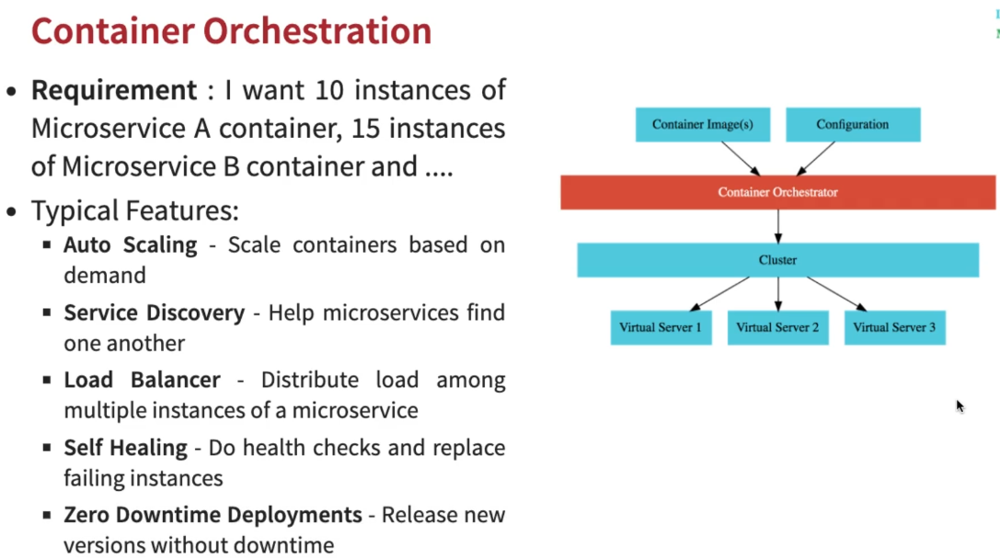

# JD:Kubernetes with Microservices using Docker, Spring Boot and Spring Cloud - V2

## For detail kubernetes-crash-course visit below URL
- https://github.com/jdbirla/jd-kubernetes-crash-course

---
## What You Will Learn during this Step 01:
- Docker, Kubernetes and Microservices - Made for each other

