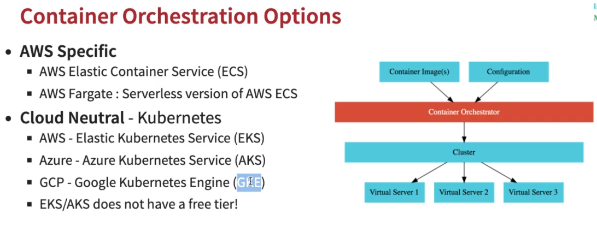

# JD:Kubernetes with Microservices using Docker, Spring Boot and Spring Cloud - V2

## For detail kubernetes-crash-course visit below URL
- https://github.com/jdbirla/jd-kubernetes-crash-course

---
## What You Will Learn during this Step 00:
- Docker, Kubernetes and Microservices - Made for each other

## What You Will Learn during this Step 01:
- Getting Started with Docker, Kubernetes and Google Kubernetes Engine

---
## What You Will Learn during this Step 02:

-  Step 02 - Creating Google Cloud Account
---

## What You Will Learn during this Step 03:

-  Step 03 - Creating Kubernetes Cluster with Google Kubernete Engine (GKE)
---

## What You Will Learn during this Step 04:

-  Step 04 - Review Kubernetes Cluster and Learn Few Fun Facts about Kubernetes
---
## What You Will Learn during this Step 04:

-  Step 05 - Deploy Your First Spring Boot Application to Kubernetes Cluster
---
## What You Will Learn during this Step 04:

-  Step 06 - Quick Look at Kubernetes Concepts - Pods, Replica Sets and Deployment
---
## What You Will Learn during this Step 04:

-  Step 07 - Understanding Pods in Kubernetes
---
## What You Will Learn during this Step 04:

-  Step 08 - Understanding ReplicaSets in Kubernetes
---
## What You Will Learn during this Step 04:

-  Step 09 - Understanding Deployment in Kubernetes
---
## What You Will Learn during this Step 04:

-  Step 10 - Quick Review of Kubernetes Concepts - Pods, Replica Sets and Deployment
---
## What You Will Learn during this Step 04:

-  Step 11 - Understanding Services in Kubernetes
---
## What You Will Learn during this Step 04:

-  Step 12 - Quick Review of GKE on Google Cloud Console 
---
## What You Will Learn during this Step 04:

-  Step 13 - Understanding Kubernetes Architecture - Master Node and Nodes
---
## What You Will Learn during this Step 04:

-  Step 14 - Setup Currency Exchange & Currency Conversion Microservices - K8S versions
---
## What You Will Learn during this Step 04:

-  Step 15 - Create Container images for Currency Exchange & Currency Conversion Microservices
---
## What You Will Learn during this Step 04:

-  Step 16 - Deploy Microservices to Kubernetes & Understand Service Discovery
---
## What You Will Learn during this Step 04:

-  Step 17 - Creating Declarative Configuration Kubernetes YAML for Microservices
---
## What You Will Learn during this Step 04:

-  Step 18 - Clean up Kubernetes YAML for Microservices
---
## What You Will Learn during this Step 04:

-  Step 19 - Enable Logging and Tracing APIs in Google Cloud Platform
---
## What You Will Learn during this Step 04:

-  Step 20 - Deploying Microservices using Kubernetes YAML Configuration
---
## What You Will Learn during this Step 04:

-  Step 21 - Playing with Kubernetes Declarative YAML Configuration
---
## What You Will Learn during this Step 04:

-  Step 22 - Creating Environment Variables to enable Microservice Communication
---
## What You Will Learn during this Step 04:

-  Step 23 - Understanding Centralized Configuration in Kubernetes - Config Maps
---
## What You Will Learn during this Step 04:

-  Step 24 - Exploring Centralized Logging and Monitoring in GKE
---
## What You Will Learn during this Step 04:

-  Step 25 - Exploring Microservices Deployments with Kubernetes
---
## What You Will Learn during this Step 04:

-  Step 26 - Configuring Liveness and Readiness Probes for Microservices with K8S
---
## What You Will Learn during this Step 04:

-  Step 27 - Autoscaling Microservices with Kubernetes
---
## What You Will Learn during this Step 04:

-  Step 28 - Delete Kubernetes Cluster and Thank You!
---

