# Spring Microservices V2

## What You Will Learn during this Step 01:
- Setting up Limits Microservice

On Spring Initializr, choose:
- Group Id: com.in28minutes.microservices
- Artifact Id: limits-service
- Dependencies
	- Web
	- DevTools
	- Actuator
	- Config Client

```properties
spring.config.import=optional:configserver:http://localhost:8888
```
---
## What You Will Learn during this Step 02:

- Creating a hard coded limits service

* /limits-service/src/main/java/com/jd/microservices/limitsservice/controller/LimitsController.java

```java
package com.jd.microservices.limitsservice.controller;

import org.springframework.web.bind.annotation.GetMapping;
import org.springframework.web.bind.annotation.RestController;

import com.jd.microservices.limitsservice.bean.Limits;

@RestController
public class LimitsController {
	
	@GetMapping("/limits")
	public Limits retrieveLimits() {
		return new Limits(1,1000);
	}

}

```
* com.jd.microservices.limitsservice.bean.Limits
```java
package com.jd.microservices.limitsservice.bean;

public class Limits {
	private int minimum;
	private int maximum;

	public Limits() {
		super();
	}

	public Limits(int minimum, int maximum) {
		super();
		this.minimum = minimum;
		this.maximum = maximum;
	}

	public int getMinimum() {
		return minimum;
	}

	public void setMinimum(int minimum) {
		this.minimum = minimum;
	}

	public int getMaximum() {
		return maximum;
	}

	public void setMaximum(int maximum) {
		this.maximum = maximum;
	}

}
```
* Output


---
## What You Will Learn during this Step 03:

- Enhance limits service to pick up configuration from application properties

* com.jd.microservices.limitsservice.configuration.Configuration

```java
package com.jd.microservices.limitsservice.configuration;

import org.springframework.boot.context.properties.ConfigurationProperties;
import org.springframework.stereotype.Component;

@Component
@ConfigurationProperties("limits-service")
public class Configuration {
	private int minimum;
	private int maximum;

	public int getMinimum() {
		return minimum;
	}

	public void setMinimum(int minimum) {
		this.minimum = minimum;
	}

	public int getMaximum() {
		return maximum;
	}

	public void setMaximum(int maximum) {
		this.maximum = maximum;
	}

}
```

* application.properties

```java
spring.config.import=optional:configserver:http://localhost:8888
limits-service.minimum=2
limits-service.maximum=998
```

* com.jd.microservices.limitsservice.controller.LimitsController

```java
@Autowired
	private Configuration configuration;
	
	@GetMapping("/limits")
	public Limits retrieveLimits() {
		//return new Limits(1,1000);
		return new Limits(configuration.getMinimum(),configuration.getMaximum());
	}

```

* Output


---
## What You Will Learn during this Step 04:

- Setting up Spring Cloud Config Server

* Design


On Spring Initializr, choose:
- Group Id: com.jd.microservices
- Artifact Id: spring-cloud-config-server
- Dependencies
	- DevTools
	- Config Server

* application.properties

```java
spring.application.name=spring-cloud-config-server
server.port=8888
```
---
## What You Will Learn during this Step 05:

- Installing Git and Creating Local Git Repository

* git-localconfig-repo add properties file limit-service properties

```properties
limits-service.minimum=4
limits-service.maximum=996
```
---
## What You Will Learn during this Step 06:

- Connect Spring Cloud Config Server to Local Git Repository

* /spring-cloud-config-server/src/main/java/com/jd/microservices/springcloudconfigserver/SpringCloudConfigServerApplication.java

```java
@EnableConfigServer
@SpringBootApplication
public class SpringCloudConfigServerApplication {

	public static void main(String[] args) {
		SpringApplication.run(SpringCloudConfigServerApplication.class, args);
	}

}
```

* /spring-cloud-config-server/src/main/resources/application.properties

```properties
spring.application.name=spring-cloud-config-server
server.port=8888
spring.cloud.config.server.git.uri=file:///C:/JD_Spring_Microservices/microservices/V2/local-git-localconfig-repo
```
* Local git repository


* Output


---
## What You Will Learn during this Step 07:
- Connect Limits Service to Spring Cloud Config Server
- spring.application.name=limit-service  name should be exact same as local-git-localconfig-repo/limit-service properties file
-  Config server has higher priority then local 

URLS
- http://localhost:8888/limits-service/default
- http://localhost:8080/limits

* /limits-service/src/main/resources/application.properties
```properties
spring.application.name=limit-service
spring.config.import=optional:configserver:http://localhost:8888
limits-service.minimum=2
limits-service.maximum=998
```

* Local git repository config server


* Limit service now connected to config server and getting values from local git


---
## What You Will Learn during this Step 08:
- Configuring Profiles for Limits Service

- http://localhost:8888/limits-service/default
- http://localhost:8888/limits-service/qa
- http://localhost:8888/limits-service/dev

* /limits-service/src/main/resources/application.properties added profiles as dev

```properties
spring.application.name=limit-service
spring.config.import=optional:configserver:http://localhost:8888

spring.profiles.active=dev

limits-service.minimum=2
limits-service.maximum=998

```

#### JD_Spring_Microservices/microservices/V2/local-git-localconfig-repo/limit-service.properties existing
```properties
limits-service.minimum=4
limits-service.maximum=990
```


#### JD_Spring_Microservices/microservices/V2/local-git-localconfig-repo/limit-service-dev.properties New
```properties
limits-service.minimum=5
limits-service.maximum=995
```

#### JD_Spring_Microservices/microservices/V2/local-git-localconfig-repo/limit-service-qa.properties New
```properties
limits-service.minimum=6
limits-service.maximum=994

```


#### JD_Spring_Microservices/microservices/V2/local-git-localconfig-repo/microservice-x-dev.properties New
```properties
limits-service.minimum=4
limits-service.maximum=996
```


#### JD_Spring_Microservices/microservices/V2/local-git-localconfig-repo/microservice-x.properties New
```properties
limits-service.minimum=4
limits-service.maximum=996
```


#### JD_Spring_Microservices/microservices/V2/local-git-localconfig-repo/microservice-y.properties New
```properties
limits-service.minimum=4
limits-service.maximum=996
```

* Config server default profiles


* Config server dev profiles


* Config server qa profiles


* limit service connected with Config server with dev profiles active


---
## What You Will Learn during this Step 09:
- Introduction to Currency Conversion and Exchange Microservices

* Microservices Overview


* Currency Exchange Microservice


* Currency Conversion Microservice


---
## What You Will Learn during this Step 10:
On Spring Initializr, choose:
- Group Id: com.jd.microservices
- Artifact Id: currency-exchange-service
- Dependencies
	- Web
	- DevTools
	- Actuator
	- Config Client
	
#### /currency-exchange-service/src/main/resources/application.properties Modified

```properties
spring.config.import=optional:configserver:http://localhost:8888
spring.application.name=currency-exchange
server.port=8000
```

---
## What You Will Learn during this Step 11:

- Create a simple hard coded currency exchange service

URL
- http://localhost:8000/currency-exchange/from/USD/to/INR

*com.jd.microservices.currencyexchangeservice.CurrencyExchange
```java
package com.jd.microservices.currencyexchangeservice;

import java.math.BigDecimal;

public class CurrencyExchange {
	
	private Long id;
	
	private String from;
	
	private String to;

	private BigDecimal conversionMultiple;

	public CurrencyExchange() {
		
	}
	
	public CurrencyExchange(Long id, String from, String to, BigDecimal conversionMultiple) {
		super();
		this.id = id;
		this.from = from;
		this.to = to;
		this.conversionMultiple = conversionMultiple;
	}

	public Long getId() {
		return id;
	}

	public void setId(Long id) {
		this.id = id;
	}

	public String getFrom() {
		return from;
	}

	public void setFrom(String from) {
		this.from = from;
	}

	public String getTo() {
		return to;
	}

	public void setTo(String to) {
		this.to = to;
	}

	public BigDecimal getConversionMultiple() {
		return conversionMultiple;
	}

	public void setConversionMultiple(BigDecimal conversionMultiple) {
		this.conversionMultiple = conversionMultiple;
	}

	
}
```


*com.jd.microservices.currencyexchangeservice.CurrencyExchangeController
```java
package com.jd.microservices.currencyexchangeservice;

import java.math.BigDecimal;

import org.springframework.web.bind.annotation.GetMapping;
import org.springframework.web.bind.annotation.PathVariable;
import org.springframework.web.bind.annotation.RestController;

@RestController
public class CurrencyExchangeController {
		
	@GetMapping("/currency-exchange/from/{from}/to/{to}")
	public CurrencyExchange retrieveExchangeValue(
			@PathVariable String from,
			@PathVariable String to) {
		return new CurrencyExchange(1000L, from, to, 
						BigDecimal.valueOf(50));
		
	}

}
```

* Output


---
## What You Will Learn during this Step 12:

- Setting up Dynamic Port in the the Response
- VM Arguments : -Dserver.port=8001 to launch on 8001

* com.jd.microservices.currencyexchangeservice.CurrencyExchangeController
- Setting Environment

* Microservices Design


```java
package com.jd.microservices.currencyexchangeservice;

import java.math.BigDecimal;

import org.springframework.beans.factory.annotation.Autowired;
import org.springframework.core.env.Environment;
import org.springframework.web.bind.annotation.GetMapping;
import org.springframework.web.bind.annotation.PathVariable;
import org.springframework.web.bind.annotation.RestController;

@RestController
public class CurrencyExchangeController {
	
	@Autowired
	private Environment environment;
		
	@GetMapping("/currency-exchange/from/{from}/to/{to}")
	public CurrencyExchange retrieveExchangeValue(
			@PathVariable String from,
			@PathVariable String to) {
		CurrencyExchange currencyExchange = new CurrencyExchange(1000L, from, to, 
								BigDecimal.valueOf(50));
		String port = environment.getProperty("local.server.port");
		currencyExchange.setEnvironment(port)	;
		return currencyExchange;
		
	}

}
```

*com.jd.microservices.currencyexchangeservice.CurrencyExchange
- Adding `private String environment` and getters and setters

```java
package com.jd.microservices.currencyexchangeservice;

import java.math.BigDecimal;

public class CurrencyExchange {
	
	private Long id;
	
	private String from;
	
	private String to;

	private BigDecimal conversionMultiple;
	
	private String environment;

	public CurrencyExchange() {
		
	}
	
	public CurrencyExchange(Long id, String from, String to, BigDecimal conversionMultiple) {
		super();
		this.id = id;
		this.from = from;
		this.to = to;
		this.conversionMultiple = conversionMultiple;
	}

	public Long getId() {
		return id;
	}

	public void setId(Long id) {
		this.id = id;
	}

	public String getFrom() {
		return from;
	}

	public void setFrom(String from) {
		this.from = from;
	}

	public String getTo() {
		return to;
	}

	public void setTo(String to) {
		this.to = to;
	}

	public BigDecimal getConversionMultiple() {
		return conversionMultiple;
	}

	public void setConversionMultiple(BigDecimal conversionMultiple) {
		this.conversionMultiple = conversionMultiple;
	}

	public String getEnvironment() {
		return environment;
	}

	public void setEnvironment(String environment) {
		this.environment = environment;
	}

	
}
```
* Runing currency-exchange microservice on multiple ports 8000 and 8001


* Output

* http://localhost:8000/currency-exchange/from/USD/to/INR


* http://localhost:8001/currency-exchange/from/USD/to/INR


---
## What You Will Learn during this Step 13:


- If you are Spring Boot >=2.5.0, You would need to configure this in application.properties `spring.jpa.defer-datasource-initialization=true` 
	- OR use schema.sql instead of data.sql
	- More details - https://github.com/spring-projects/spring-boot/wiki/Spring-Boot-2.5.0-M3-Release-Notes#hibernate-and-datasql
- Complete debugging guide for problems with JPA and Hibernate: https://github.com/in28minutes/in28minutes-initiatives/blob/master/The-in28Minutes-TroubleshootingGuide-And-FAQ/jpa-and-hibernate.md#tables-are-not-created

#### /currency-exchange-service/pom.xml Modified
* New Lines
```xml
		<dependency>
			<groupId>org.springframework.boot</groupId>
			<artifactId>spring-boot-starter-data-jpa</artifactId>
		</dependency>
		<dependency>
			<groupId>com.h2database</groupId>
			<artifactId>h2</artifactId>
		</dependency>
```

* com.jd.microservices.currencyexchangeservice.CurrencyExchange
- Modified changed to entity
```java
package com.jd.microservices.currencyexchangeservice;

import java.math.BigDecimal;

import javax.persistence.Column;
import javax.persistence.Entity;
import javax.persistence.Id;


@Entity
public class CurrencyExchange {
	
	@Id
	private Long id;
	
	@Column(name = "currency_from")
	private String from;
	
	@Column(name = "currency_to")
	private String to;

	private BigDecimal conversionMultiple;
	
	private String environment;

	public CurrencyExchange() {
		
	}
	
	public CurrencyExchange(Long id, String from, String to, BigDecimal conversionMultiple) {
		super();
		this.id = id;
		this.from = from;
		this.to = to;
		this.conversionMultiple = conversionMultiple;
	}

	public Long getId() {
		return id;
	}

	public void setId(Long id) {
		this.id = id;
	}

	public String getFrom() {
		return from;
	}

	public void setFrom(String from) {
		this.from = from;
	}

	public String getTo() {
		return to;
	}

	public void setTo(String to) {
		this.to = to;
	}

	public BigDecimal getConversionMultiple() {
		return conversionMultiple;
	}

	public void setConversionMultiple(BigDecimal conversionMultiple) {
		this.conversionMultiple = conversionMultiple;
	}

	public String getEnvironment() {
		return environment;
	}

	public void setEnvironment(String environment) {
		this.environment = environment;
	}

	
}
```
#### /currency-exchange-service/src/main/resources/application.properties Modified
- New Lines
```properties
spring.config.import=optional:configserver:http://localhost:8888
spring.application.name=currency-exchange
server.port=8000
spring.jpa.show-sql=true
spring.datasource.url=jdbc:h2:mem:testdb
spring.h2.console.enabled=true
spring.jpa.defer-datasource-initialization=true
```

#### /currency-exchange-service/src/main/resources/schema.sql New
```sql
insert into currency_exchange
(id,currency_from,currency_to,conversion_multiple,environment)
values(10001,'USD','INR',65,'');
insert into currency_exchange
(id,currency_from,currency_to,conversion_multiple,environment)
values(10002,'EUR','INR',75,'');
insert into currency_exchange
(id,currency_from,currency_to,conversion_multiple,environment)
values(10003,'AUD','INR',25,'');
```
* Output


---
## What You Will Learn during this Step 14:
- Create a JPA Repository

* com.jd.microservices.currencyexchangeservice.CurrencyExchangeRepository
```java
package com.jd.microservices.currencyexchangeservice;

import org.springframework.data.jpa.repository.JpaRepository;

public interface CurrencyExchangeRepository 
	extends JpaRepository<CurrencyExchange, Long> {
	CurrencyExchange findByFromAndTo(String from, String to);
}
```

* com.jd.microservices.currencyexchangeservice.CurrencyExchangeController

```java
package com.jd.microservices.currencyexchangeservice;

import org.springframework.beans.factory.annotation.Autowired;
import org.springframework.core.env.Environment;
import org.springframework.web.bind.annotation.GetMapping;
import org.springframework.web.bind.annotation.PathVariable;
import org.springframework.web.bind.annotation.RestController;

@RestController
public class CurrencyExchangeController {

	@Autowired
	private Environment environment;

	@Autowired
	private CurrencyExchangeRepository repository;

	@GetMapping("/currency-exchange/from/{from}/to/{to}")
	public CurrencyExchange retrieveExchangeValue(@PathVariable String from, @PathVariable String to) {
		//CurrencyExchange currencyExchange = new CurrencyExchange(1000L, from, to, BigDecimal.valueOf(50));

		CurrencyExchange currencyExchange = repository.findByFromAndTo(from, to);

		if (currencyExchange == null) {
			throw new RuntimeException("Unable to Find data for " + from + " to " + to);
		}

		String port = environment.getProperty("local.server.port");
		currencyExchange.setEnvironment(port);
		return currencyExchange;

	}

}
```
* Output


---
## What You Will Learn during this Step 15:
- Setting up Currency Conversion Microservice
On Spring Initializr, choose:
- Group Id: com.jd.microservices
- Artifact Id: currency-conversion-service
- Dependencies
	- Web
	- DevTools
	- Actuator
	- Config Client
Create Currency Conversion Microservice using Spring Initializr.
#### /currency-conversion-service/src/main/resources/application.properties Modified
```properties
spring.application.name=currency-conversion
server.port=8100
spring.config.import=optional:configserver:http://localhost:8888
```
---
## What You Will Learn during this Step 16:

- Creating a service for currency conversion
URL
- http://localhost:8100/currency-conversion/from/USD/to/INR/quantity/10

* Design
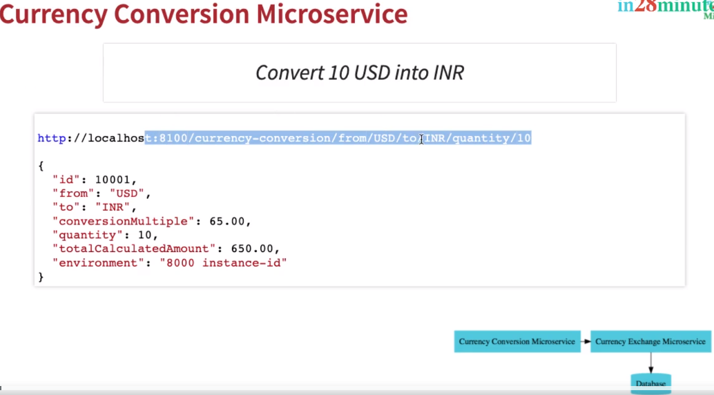

* com.jd.microservices.currencyconversionservice.CurrencyConversionController
```java
package com.jd.microservices.currencyconversionservice;

import java.math.BigDecimal;
import java.util.HashMap;

import org.springframework.web.bind.annotation.GetMapping;
import org.springframework.web.bind.annotation.PathVariable;
import org.springframework.web.bind.annotation.RestController;

@RestController
public class CurrencyConversionController {
	
	
	@GetMapping("/currency-conversion/from/{from}/to/{to}/quantity/{quantity}")
	public CurrencyConversion calculateCurrencyConversion(
			@PathVariable String from,
			@PathVariable String to,
			@PathVariable BigDecimal quantity
			) {
				
		return new CurrencyConversion(10001L, 
				from, to, quantity, 
				BigDecimal.ONE, 
				BigDecimal.ONE, 
				"");
		
	}

}
```

* com.jd.microservices.currencyconversionservice.CurrencyConversion
```java
package com.jd.microservices.currencyconversionservice;

import java.math.BigDecimal;

public class CurrencyConversion {
	private Long id;
	private String from;
	private String to;
	private BigDecimal quantity;
	private BigDecimal conversionMultiple;
	private BigDecimal totalCalculatedAmount;
	private String environment;

	public CurrencyConversion() {
		
	}
	
	public CurrencyConversion(Long id, String from, String to, BigDecimal quantity, BigDecimal conversionMultiple, 
			BigDecimal totalCalculatedAmount, String environment) {
		super();
		this.id = id;
		this.from = from;
		this.to = to;
		this.conversionMultiple = conversionMultiple;
		this.quantity = quantity;
		this.totalCalculatedAmount = totalCalculatedAmount;
		this.environment = environment;
	}

	public Long getId() {
		return id;
	}

	public void setId(Long id) {
		this.id = id;
	}

	public String getFrom() {
		return from;
	}

	public void setFrom(String from) {
		this.from = from;
	}

	public String getTo() {
		return to;
	}

	public void setTo(String to) {
		this.to = to;
	}

	public BigDecimal getConversionMultiple() {
		return conversionMultiple;
	}

	public void setConversionMultiple(BigDecimal conversionMultiple) {
		this.conversionMultiple = conversionMultiple;
	}

	public BigDecimal getQuantity() {
		return quantity;
	}

	public void setQuantity(BigDecimal quantity) {
		this.quantity = quantity;
	}

	public BigDecimal getTotalCalculatedAmount() {
		return totalCalculatedAmount;
	}

	public void setTotalCalculatedAmount(BigDecimal totalCalculatedAmount) {
		this.totalCalculatedAmount = totalCalculatedAmount;
	}

	public String getEnvironment() {
		return environment;
	}

	public void setEnvironment(String environment) {
		this.environment = environment;
	}
	
	
	

}
```


* Output


---
## What You Will Learn during this Step 17:

- Invoking Currency Exchange Microservice from Currency Conversion Microservice

URL
- http://localhost:8100/currency-conversion/from/USD/to/INR/quantity/10
- http://localhost:8000/currency-exchange/from/USD/to/INR
- http://localhost:8100/currency-conversion/from/EUR/to/INR/quantity/10
- http://localhost:8000/currency-exchange/from/EUR/to/INR
- http://localhost:8100/currency-conversion/from/AUD/to/INR/quantity/10
- http://localhost:8000/currency-exchange/from/AUD/to/INR

* com.jd.microservices.currencyconversionservice.CurrencyConversionController

```java
package com.jd.microservices.currencyconversionservice;

import java.math.BigDecimal;
import java.util.HashMap;

import org.springframework.http.ResponseEntity;
import org.springframework.web.bind.annotation.GetMapping;
import org.springframework.web.bind.annotation.PathVariable;
import org.springframework.web.bind.annotation.RestController;
import org.springframework.web.client.RestTemplate;

@RestController
public class CurrencyConversionController {
	
	
	@GetMapping("/currency-conversion/from/{from}/to/{to}/quantity/{quantity}")
	public CurrencyConversion calculateCurrencyConversion(
			@PathVariable String from,
			@PathVariable String to,
			@PathVariable BigDecimal quantity
			) {
		
		HashMap<String, String> uriVariables = new HashMap<String, String>();
		uriVariables.put("from", from);
		uriVariables.put("to", to);
		ResponseEntity<CurrencyConversion> reponseEntity = new RestTemplate().getForEntity("http://localhost:8000/currency-exchange/from/{from}/to/{to}", 
				CurrencyConversion.class,uriVariables);
				
		CurrencyConversion currencyConversion = reponseEntity.getBody();
		return new CurrencyConversion(currencyConversion.getId(),
				from, to, quantity, 
				currencyConversion.getConversionMultiple(), 
				quantity.multiply(currencyConversion.getConversionMultiple()), 
				currencyConversion.getEnvironment());
	}

}
```

* Output
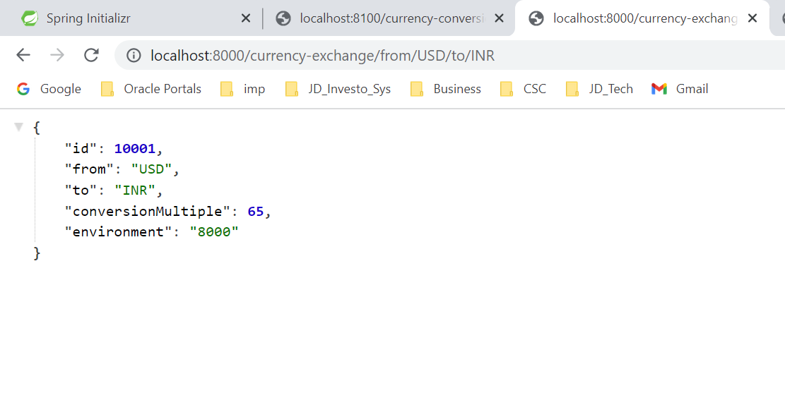
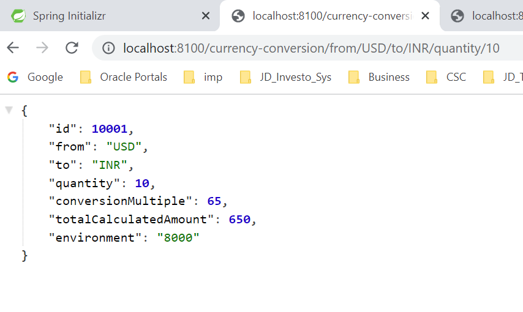
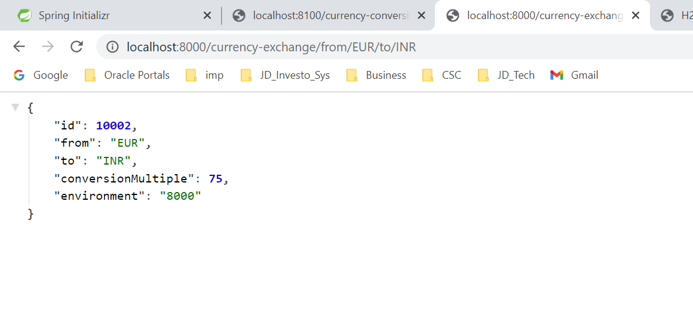
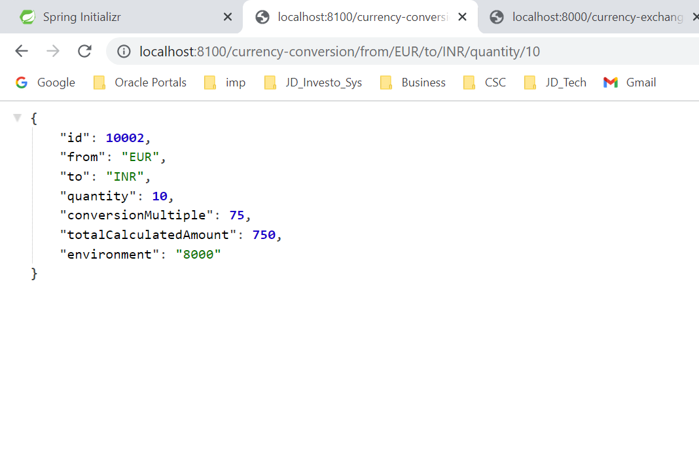
---
## What You Will Learn during this Step 18:
- Using Feign REST Client for Service Invocation
URL
- http://localhost:8000/currency-exchange/from/AUD/to/INR
- http://localhost:8100/currency-conversion-feign/from/AUD/to/INR/quantity/10

* /currency-conversion-service/pom.xml Modified
```xml
<dependency>
			<groupId>org.springframework.cloud</groupId>
			<artifactId>spring-cloud-starter-openfeign</artifactId>
		</dependency>
```

* com.jd.microservices.currencyconversionservice.CurrencyExchangeProxy
```java
package com.jd.microservices.currencyconversionservice;

import org.springframework.cloud.openfeign.FeignClient;
import org.springframework.web.bind.annotation.GetMapping;
import org.springframework.web.bind.annotation.PathVariable;


@FeignClient(name="currency-exchange", url="localhost:8000")
public interface CurrencyExchangeProxy {
	
	@GetMapping("/currency-exchange/from/{from}/to/{to}")
	public CurrencyConversion retrieveExchangeValue(
			@PathVariable("from") String from,
			@PathVariable("to") String to);

}
```

* com.jd.microservices.currencyconversionservice.CurrencyConversionServiceApplication adding annotation EnableFeignClients
```java
package com.jd.microservices.currencyconversionservice;

import org.springframework.boot.SpringApplication;
import org.springframework.boot.autoconfigure.SpringBootApplication;
import org.springframework.cloud.openfeign.EnableFeignClients;

@SpringBootApplication
@EnableFeignClients
public class CurrencyConversionServiceApplication {

	public static void main(String[] args) {
		SpringApplication.run(CurrencyConversionServiceApplication.class, args);
	}

}

```


* com.jd.microservices.currencyconversionservice.CurrencyConversionController adding method calculateCurrencyConversionFeign
```java
package com.jd.microservices.currencyconversionservice;

import java.math.BigDecimal;
import java.util.HashMap;

import org.springframework.beans.factory.annotation.Autowired;
import org.springframework.http.ResponseEntity;
import org.springframework.web.bind.annotation.GetMapping;
import org.springframework.web.bind.annotation.PathVariable;
import org.springframework.web.bind.annotation.RestController;
import org.springframework.web.client.RestTemplate;

@RestController
public class CurrencyConversionController {

	@Autowired
	private CurrencyExchangeProxy currencyExchangeProxy;


	@GetMapping("/currency-conversion-feign/from/{from}/to/{to}/quantity/{quantity}")
	public CurrencyConversion calculateCurrencyConversionFeign(@PathVariable String from, @PathVariable String to,
			@PathVariable BigDecimal quantity) {

		CurrencyConversion currencyConversion = currencyExchangeProxy.retrieveExchangeValue(from, to);
		return new CurrencyConversion(currencyConversion.getId(), from, to, quantity,
				currencyConversion.getConversionMultiple(),
				quantity.multiply(currencyConversion.getConversionMultiple()), currencyConversion.getEnvironment() + " " + "feign");
	}

}
```

* Output

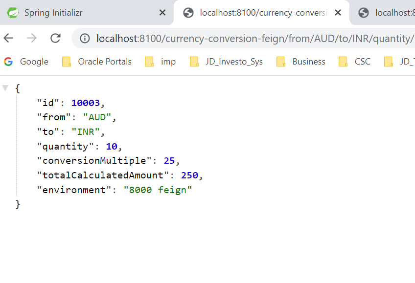


### Debugging problems with Feign

(1) Ensure that you have the annotation @EnableFeignClients with right packages on the class public class CurrencyConversionServiceApplication @EnableFeignClients("com.in28minutes.microservices.currencyconversionservice")
(2) Ensure you have path variables defined for from and to with the key from and to as shown in CurrencyExchangeServiceProxy - @PathVariable("from") String from, @PathVariable("to") String to
NOTE : Some students reported adding "from" and "to" to @PathVariables helped!
```
	@GetMapping("/currency-exchange/from/{from}/to/{to}")
	public CurrencyConversion retrieveExchangeValue(
			@PathVariable("from") String from,
			@PathVariable("to") String to);
```
If everything is fine
(-1) What Step was code working until?
(0) What is the step where you are facing a Problem?
(1) Make sure you start the services in this order (a)currency-exchange-service (b)currency-conversion-service
(2) Give a minute of warm up time!

---

### Debugging problems with Feign  Eureka - Step 19 to 21


If you see an error of this kind - Wait for 5 minutes and give it a try again!

```
com.netflix.client.ClientException: Load balancer does not have available server for client: 
```

(0) Give these settings a try individually in application.properties of all microservices (currency-exchange, currency-conversion, api-gateway) to see if they help

```
eureka.instance.prefer-ip-address=true
```

OR

```
eureka.instance.hostname=localhost
```

(1) Ensure @EnableEurekaServer is enabled on NetflixEurekaNamingServerApplication

(2) spring-cloud-starter-netflix-eureka-client dependency is added in both the client application pom.xml files.

(3) eureka.client.service-url.default-zone=http://localhost:8761/eureka is configured in application.properties of both currency-exchange-service and currency-conversion-service

(4) Ensure that both the services are registered with Eureka at http://localhost:8761/

(5) Ensure that you are using the right url - http://localhost:8100/currency-conversion-feign/from/USD/to/INR/quantity/10

(6) Ensure that you are able to hit the urls directly - http://localhost:8000/currency-exchange/from/USD/to/INR and http://localhost:8100/currency-conversion/from/USD/to/INR/quantity/10

(8) Try if it works when you include the following property in application.properties for currency-conversion-service and currency-exchange-service

```
eureka.instance.hostname=localhost
```
(9) Compare code against the complete list of components below (Step 19 to Step 21).

If everything is fine

(1) Make sure you start the services in this order (a)netflix-eureka-naming-server (b)currency-exchange-service (c)currency-conversion-service

(2) Make sure all the components are registered with naming server.

(3) Give a minute of warm up time!

(4) If you get an error once, execute it again after a few minutes


---
## What You Will Learn during this Step 19:
- Understand Naming Server and Setting up Eureka Naming Server

* Design

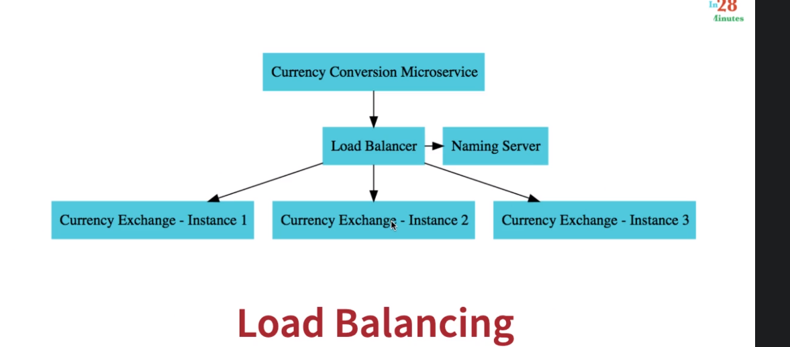
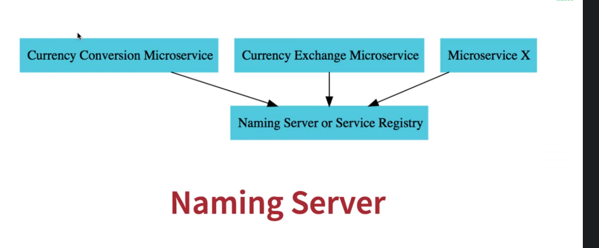

* /naming-server/src/main/java/com/jd/microservices/namingserver/NamingServerApplication.java adding - Add @EnableEurekaServer
```java
package com.jd.microservices.namingserver;

import org.springframework.boot.SpringApplication;
import org.springframework.boot.autoconfigure.SpringBootApplication;
import org.springframework.cloud.netflix.eureka.server.EnableEurekaServer;

@SpringBootApplication
@EnableEurekaServer
public class NamingServerApplication {

	public static void main(String[] args) {
		SpringApplication.run(NamingServerApplication.class, args);
	}

}

```

#### /naming-server/src/main/resources/application.properties Modified

```properties
spring.application.name=naming-server
server.port=8761

eureka.client.register-with-eureka=false
eureka.client.fetch-registry=false

```

* Output

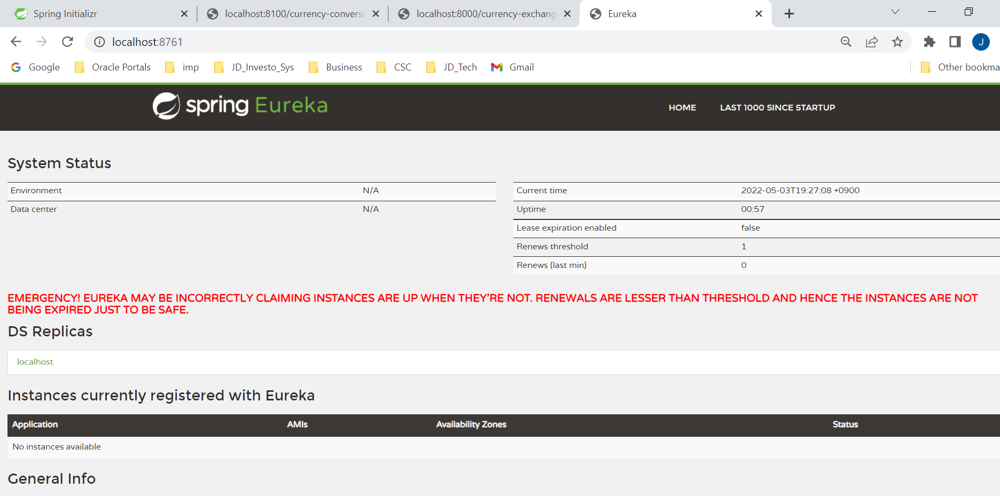

---
## What You Will Learn during this Step 20:
- Connect Currency Conversion Microservice & Currency Exchange Microservice to Eureka


#### /currency-conversion-service/src/main/resources/application.properties Modified
New Lines
```properties
eureka.client.serviceUrl.defaultZone=http://localhost:8761/eureka
```

#### /currency-conversion-service/pom.xml Modified
New Lines
```xml
		<dependency>
			<groupId>org.springframework.cloud</groupId>
			<artifactId>spring-cloud-starter-netflix-eureka-client</artifactId>
		</dependency>

```

#### /currency-exchange-service/pom.xml Modified
New Lines
```xml
		<dependency>
			<groupId>org.springframework.cloud</groupId>
			<artifactId>spring-cloud-starter-netflix-eureka-client</artifactId>
		</dependency>

```
#### /currency-exchange-service/src/main/resources/application.properties Modified
New Lines
```properties
eureka.client.serviceUrl.defaultZone=http://localhost:8761/eureka
```

* Output

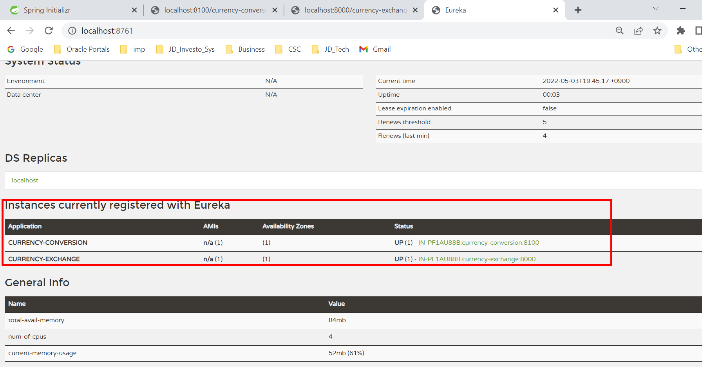

---
## What You Will Learn during this Step 22:
- Load Balancing with Eureka, Feign & Spring Cloud LoadBalancer

* com.jd.microservices.currencyconversionservice.CurrencyExchangeProxy
```java
package com.jd.microservices.currencyconversionservice;

import org.springframework.cloud.openfeign.FeignClient;
import org.springframework.web.bind.annotation.GetMapping;
import org.springframework.web.bind.annotation.PathVariable;


//@FeignClient(name="currency-exchange", url="localhost:8000")
@FeignClient(name="currency-exchange")
public interface CurrencyExchangeProxy {
	
	@GetMapping("/currency-exchange/from/{from}/to/{to}")
	public CurrencyConversion retrieveExchangeValue(
			@PathVariable("from") String from,
			@PathVariable("to") String to);

}
```
* Output

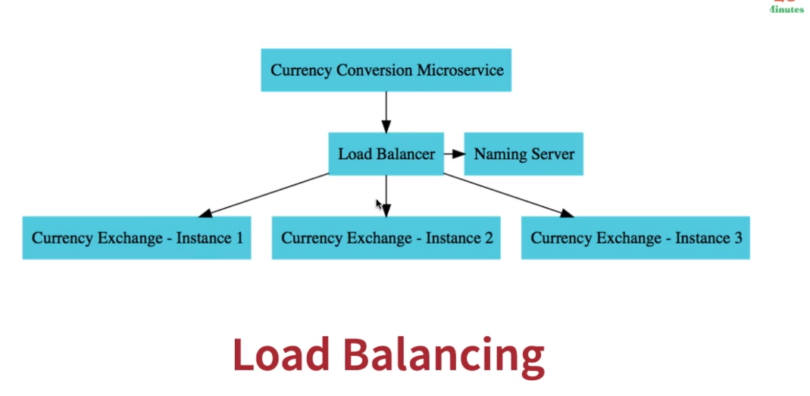
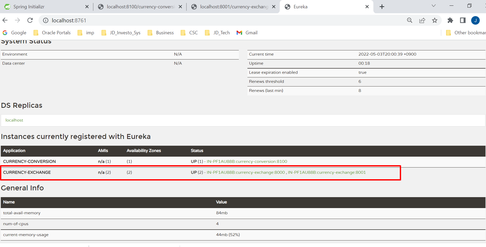
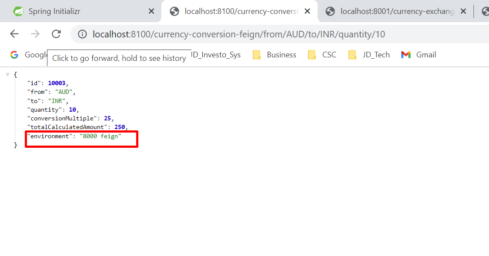
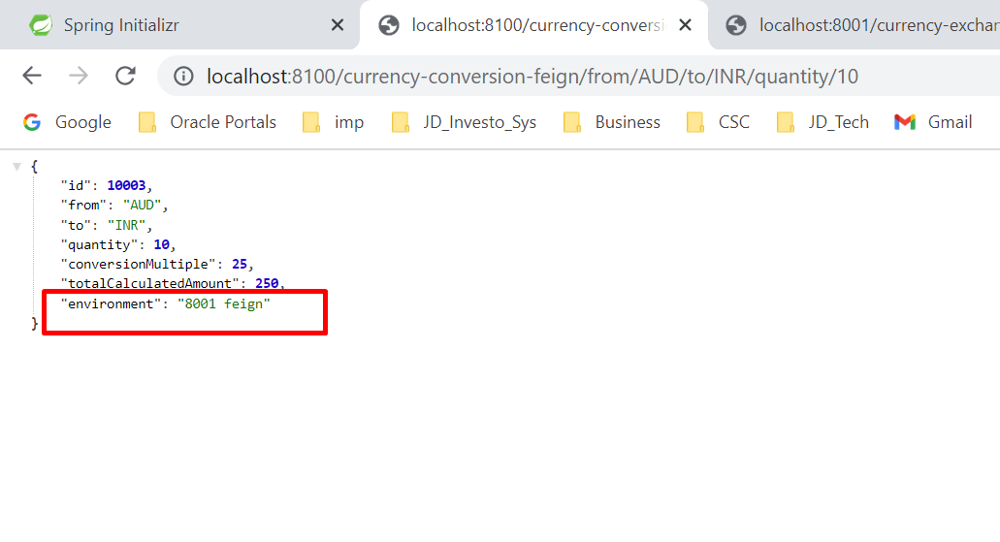

---
### Debugging problems with Spring Cloud API Gateway - Step 22 to Step 25
---
(1) Make sure you are using the right URLs?
Discovery
- http://localhost:8765/CURRENCY-EXCHANGE/currency-exchange/from/USD/to/INR
- http://localhost:8765/CURRENCY-CONVERSION/currency-conversion/from/USD/to/INR/quantity/10
- http://localhost:8765/CURRENCY-CONVERSION/currency-conversion-feign/from/USD/to/INR/quantity/10
LowerCase
- http://localhost:8765/currency-exchange/currency-exchange/from/USD/to/INR
- http://localhost:8765/currency-conversion/currency-conversion/from/USD/to/INR/quantity/10
- http://localhost:8765/currency-conversion/currency-conversion-feign/from/USD/to/INR/quantity/10
Discovery Disabled and Custom Routes Configured
- http://localhost:8765/currency-exchange/from/USD/to/INR
- http://localhost:8765/currency-conversion/from/USD/to/INR/quantity/10
- http://localhost:8765/currency-conversion-feign/from/USD/to/INR/quantity/10
- http://localhost:8765/currency-conversion-new/from/USD/to/INR/quantity/10
(2) Enable wiretap to see more details
```
spring.cloud.gateway.httpserver.wiretap=true and spring.cloud.gateway.httpclient.wiretap=true
```
(3) Give these settings a try individually in application.properties of all microservices (currency-exchange, currency-conversion, api-gateway) to see if they help
```
eureka.instance.prefer-ip-address=true
```
OR
```
eureka.instance.hostname=localhost
```
(4) Are you using right configuration?
```
spring.application.name=api-gateway
server.port=8765
eureka.client.serviceUrl.defaultZone=http://localhost:8761/eureka
#spring.cloud.gateway.discovery.locator.enabled=true
#spring.cloud.gateway.discovery.locator.lowerCaseServiceId=true
```
(5) Compare against the code for ApiGatewayConfiguration below?
(6) Compare against the code for LoggingFilter below?
(7) Ensure that all the three services are registered with Eureka at http://localhost:8761/.
(8) Try if it works when you include the following property in application.properties for currency-conversion-service and currency-exchange-service
```
eureka.instance.hostname=localhost
```
(9) Some student reported success when using lower-case-service-id instead of spring.cloud.gateway.discovery.locator.lowerCaseServiceId. See if it helps!
```
spring.cloud.gateway.discovery.locator.enabled=true
spring.cloud.gateway.discovery.locator.lower-case-service-id=true
#spring.cloud.gateway.discovery.locator.lowerCaseServiceId=true
```
(10) Compare code against the complete list of components below.
If everything is fine
(1) Make sure you start the services in this order (a) netflix-eureka-naming-server (b) netflix-zuul-api-gateway-server (c)currency-exchange-service (d)currency-conversion-service
(2) Make sure all the components are registered with naming server.
(3) Give a minute of warm up time!
(4) If you get an error once, execute it again after 5 minutes

---
## What You Will Learn during this Step 22:
- Setting up Spring Cloud API Gateway
On Spring Initializr, choose:
- Group Id: com.jd.microservices
- Artifact Id: api-gateway
- Dependencies
	- DevTools
	- Actuator
	- Config Client
	- Eureka Discovery Client
	- Gateway (Spring Cloud Routing)
#### /api-gateway/src/main/resources/application.properties Modified
```properties
spring.application.name=api-gateway
server.port=8765
eureka.client.serviceUrl.defaultZone=http://localhost:8761/eureka
```

* Output

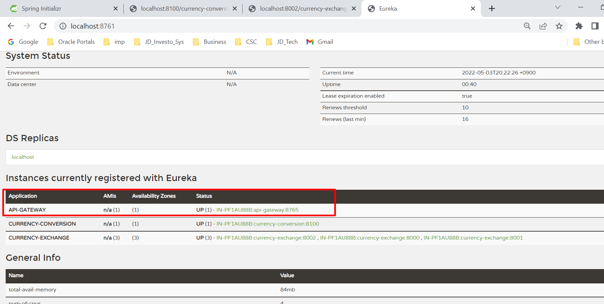

---
## What You Will Learn during this Step 23:
- Enabling Discovery Locator with Eureka for Spring Cloud Gateway

Initial
- http://localhost:8765/CURRENCY-EXCHANGE/currency-exchange/from/USD/to/INR
- http://localhost:8765/CURRENCY-CONVERSION/currency-conversion/from/USD/to/INR/quantity/10
- http://localhost:8765/CURRENCY-CONVERSION/currency-conversion-feign/from/USD/to/INR/quantity/10
Intermediate
- http://localhost:8765/currency-exchange/currency-exchange/from/USD/to/INR
- http://localhost:8765/currency-conversion/currency-conversion/from/USD/to/INR/quantity/10
- http://localhost:8765/currency-conversion/currency-conversion-feign/from/USD/to/INR/quantity/10

#### /api-gateway/src/main/resources/application.properties Modified
```properties
spring.application.name=api-gateway
server.port=8765

eureka.client.serviceUrl.defaultZone=http://localhost:8761/eureka

spring.cloud.gateway.discovery.locator.enabled=true
spring.cloud.gateway.discovery.locator.lowerCaseServiceId=true
```
* Output

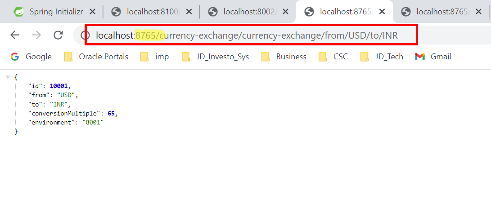
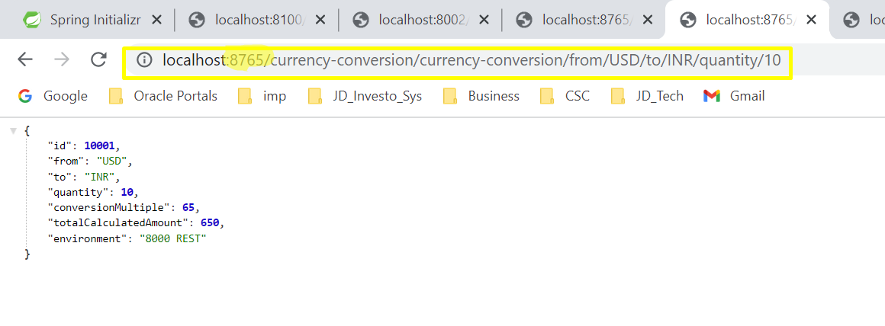
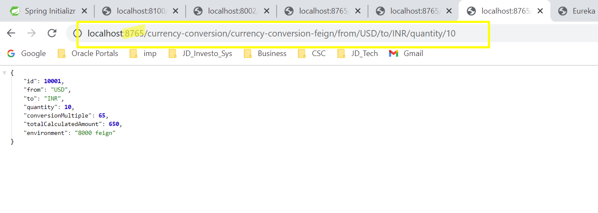

---


