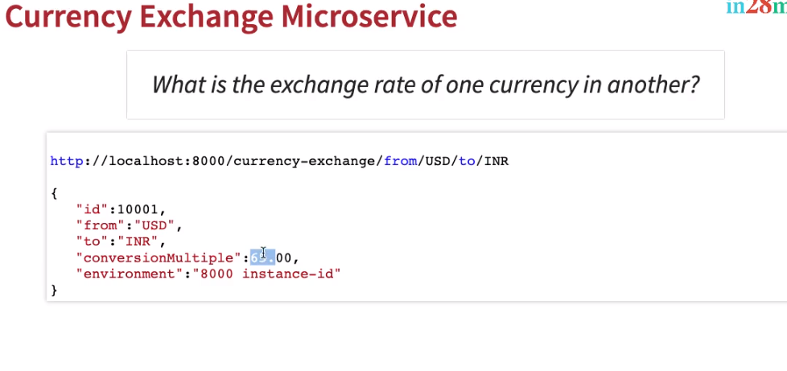

# Spring Microservices V2

## What You Will Learn during this Step 01:
- Setting up Limits Microservice

On Spring Initializr, choose:
- Group Id: com.in28minutes.microservices
- Artifact Id: limits-service
- Dependencies
	- Web
	- DevTools
	- Actuator
	- Config Client

```properties
spring.config.import=optional:configserver:http://localhost:8888
```
---
## What You Will Learn during this Step 02:

- Creating a hard coded limits service

* /limits-service/src/main/java/com/jd/microservices/limitsservice/controller/LimitsController.java

```java
package com.jd.microservices.limitsservice.controller;

import org.springframework.web.bind.annotation.GetMapping;
import org.springframework.web.bind.annotation.RestController;

import com.jd.microservices.limitsservice.bean.Limits;

@RestController
public class LimitsController {
	
	@GetMapping("/limits")
	public Limits retrieveLimits() {
		return new Limits(1,1000);
	}

}

```
* com.jd.microservices.limitsservice.bean.Limits
```java
package com.jd.microservices.limitsservice.bean;

public class Limits {
	private int minimum;
	private int maximum;

	public Limits() {
		super();
	}

	public Limits(int minimum, int maximum) {
		super();
		this.minimum = minimum;
		this.maximum = maximum;
	}

	public int getMinimum() {
		return minimum;
	}

	public void setMinimum(int minimum) {
		this.minimum = minimum;
	}

	public int getMaximum() {
		return maximum;
	}

	public void setMaximum(int maximum) {
		this.maximum = maximum;
	}

}
```
* Output


---
## What You Will Learn during this Step 03:

- Enhance limits service to pick up configuration from application properties

* com.jd.microservices.limitsservice.configuration.Configuration

```java
package com.jd.microservices.limitsservice.configuration;

import org.springframework.boot.context.properties.ConfigurationProperties;
import org.springframework.stereotype.Component;

@Component
@ConfigurationProperties("limits-service")
public class Configuration {
	private int minimum;
	private int maximum;

	public int getMinimum() {
		return minimum;
	}

	public void setMinimum(int minimum) {
		this.minimum = minimum;
	}

	public int getMaximum() {
		return maximum;
	}

	public void setMaximum(int maximum) {
		this.maximum = maximum;
	}

}
```

* application.properties

```java
spring.config.import=optional:configserver:http://localhost:8888
limits-service.minimum=2
limits-service.maximum=998
```

* com.jd.microservices.limitsservice.controller.LimitsController

```java
@Autowired
	private Configuration configuration;
	
	@GetMapping("/limits")
	public Limits retrieveLimits() {
		//return new Limits(1,1000);
		return new Limits(configuration.getMinimum(),configuration.getMaximum());
	}

```

* Output


---
## What You Will Learn during this Step 04:

- Setting up Spring Cloud Config Server

* Design


On Spring Initializr, choose:
- Group Id: com.jd.microservices
- Artifact Id: spring-cloud-config-server
- Dependencies
	- DevTools
	- Config Server

* application.properties

```java
spring.application.name=spring-cloud-config-server
server.port=8888
```
---
## What You Will Learn during this Step 05:

- Installing Git and Creating Local Git Repository

* git-localconfig-repo add properties file limit-service properties

```properties
limits-service.minimum=4
limits-service.maximum=996
```
---
## What You Will Learn during this Step 06:

- Connect Spring Cloud Config Server to Local Git Repository

* /spring-cloud-config-server/src/main/java/com/jd/microservices/springcloudconfigserver/SpringCloudConfigServerApplication.java

```java
@EnableConfigServer
@SpringBootApplication
public class SpringCloudConfigServerApplication {

	public static void main(String[] args) {
		SpringApplication.run(SpringCloudConfigServerApplication.class, args);
	}

}
```

* /spring-cloud-config-server/src/main/resources/application.properties

```properties
spring.application.name=spring-cloud-config-server
server.port=8888
spring.cloud.config.server.git.uri=file:///C:/JD_Spring_Microservices/microservices/V2/local-git-localconfig-repo
```
* Local git repository


* Output


---
## What You Will Learn during this Step 07:
- Connect Limits Service to Spring Cloud Config Server
- spring.application.name=limit-service  name should be exact same as local-git-localconfig-repo/limit-service properties file
-  Config server has higher priority then local 

URLS
- http://localhost:8888/limits-service/default
- http://localhost:8080/limits

* /limits-service/src/main/resources/application.properties
```properties
spring.application.name=limit-service
spring.config.import=optional:configserver:http://localhost:8888
limits-service.minimum=2
limits-service.maximum=998
```

* Local git repository config server


* Limit service now connected to config server and getting values from local git


---
## What You Will Learn during this Step 08:
- Configuring Profiles for Limits Service

- http://localhost:8888/limits-service/default
- http://localhost:8888/limits-service/qa
- http://localhost:8888/limits-service/dev

* /limits-service/src/main/resources/application.properties added profiles as dev

```properties
spring.application.name=limit-service
spring.config.import=optional:configserver:http://localhost:8888

spring.profiles.active=dev

limits-service.minimum=2
limits-service.maximum=998

```

#### JD_Spring_Microservices/microservices/V2/local-git-localconfig-repo/limit-service.properties existing
```properties
limits-service.minimum=4
limits-service.maximum=990
```


#### JD_Spring_Microservices/microservices/V2/local-git-localconfig-repo/limit-service-dev.properties New
```properties
limits-service.minimum=5
limits-service.maximum=995
```

#### JD_Spring_Microservices/microservices/V2/local-git-localconfig-repo/limit-service-qa.properties New
```properties
limits-service.minimum=6
limits-service.maximum=994

```


#### JD_Spring_Microservices/microservices/V2/local-git-localconfig-repo/microservice-x-dev.properties New
```properties
limits-service.minimum=4
limits-service.maximum=996
```


#### JD_Spring_Microservices/microservices/V2/local-git-localconfig-repo/microservice-x.properties New
```properties
limits-service.minimum=4
limits-service.maximum=996
```


#### JD_Spring_Microservices/microservices/V2/local-git-localconfig-repo/microservice-y.properties New
```properties
limits-service.minimum=4
limits-service.maximum=996
```

* Config server default profiles


* Config server dev profiles


* Config server qa profiles


* limit service connected with Config server with dev profiles active


---
## What You Will Learn during this Step 09:
- Introduction to Currency Conversion and Exchange Microservices

* Microservices Overview


* Currency Exchange Microservice


* Currency Conversion Microservice


---
## What You Will Learn during this Step 10:
On Spring Initializr, choose:
- Group Id: com.jd.microservices
- Artifact Id: currency-exchange-service
- Dependencies
	- Web
	- DevTools
	- Actuator
	- Config Client
	
#### /currency-exchange-service/src/main/resources/application.properties Modified

```properties
spring.config.import=optional:configserver:http://localhost:8888
spring.application.name=currency-exchange
server.port=8000
```

---
## What You Will Learn during this Step 11:

- Create a simple hard coded currency exchange service

URL
- http://localhost:8000/currency-exchange/from/USD/to/INR

*com.jd.microservices.currencyexchangeservice.CurrencyExchange
```java
package com.jd.microservices.currencyexchangeservice;

import java.math.BigDecimal;

public class CurrencyExchange {
	
	private Long id;
	
	private String from;
	
	private String to;

	private BigDecimal conversionMultiple;

	public CurrencyExchange() {
		
	}
	
	public CurrencyExchange(Long id, String from, String to, BigDecimal conversionMultiple) {
		super();
		this.id = id;
		this.from = from;
		this.to = to;
		this.conversionMultiple = conversionMultiple;
	}

	public Long getId() {
		return id;
	}

	public void setId(Long id) {
		this.id = id;
	}

	public String getFrom() {
		return from;
	}

	public void setFrom(String from) {
		this.from = from;
	}

	public String getTo() {
		return to;
	}

	public void setTo(String to) {
		this.to = to;
	}

	public BigDecimal getConversionMultiple() {
		return conversionMultiple;
	}

	public void setConversionMultiple(BigDecimal conversionMultiple) {
		this.conversionMultiple = conversionMultiple;
	}

	
}
```


*com.jd.microservices.currencyexchangeservice.CurrencyExchangeController
```java
package com.jd.microservices.currencyexchangeservice;

import java.math.BigDecimal;

import org.springframework.web.bind.annotation.GetMapping;
import org.springframework.web.bind.annotation.PathVariable;
import org.springframework.web.bind.annotation.RestController;

@RestController
public class CurrencyExchangeController {
		
	@GetMapping("/currency-exchange/from/{from}/to/{to}")
	public CurrencyExchange retrieveExchangeValue(
			@PathVariable String from,
			@PathVariable String to) {
		return new CurrencyExchange(1000L, from, to, 
						BigDecimal.valueOf(50));
		
	}

}
```

* Output


---
## What You Will Learn during this Step 12:

- Setting up Dynamic Port in the the Response
- VM Arguments : -Dserver.port=8001 to launch on 8001

* com.jd.microservices.currencyexchangeservice.CurrencyExchangeController
- Setting Environment

* Microservices Design


```java
package com.jd.microservices.currencyexchangeservice;

import java.math.BigDecimal;

import org.springframework.beans.factory.annotation.Autowired;
import org.springframework.core.env.Environment;
import org.springframework.web.bind.annotation.GetMapping;
import org.springframework.web.bind.annotation.PathVariable;
import org.springframework.web.bind.annotation.RestController;

@RestController
public class CurrencyExchangeController {
	
	@Autowired
	private Environment environment;
		
	@GetMapping("/currency-exchange/from/{from}/to/{to}")
	public CurrencyExchange retrieveExchangeValue(
			@PathVariable String from,
			@PathVariable String to) {
		CurrencyExchange currencyExchange = new CurrencyExchange(1000L, from, to, 
								BigDecimal.valueOf(50));
		String port = environment.getProperty("local.server.port");
		currencyExchange.setEnvironment(port)	;
		return currencyExchange;
		
	}

}
```

*com.jd.microservices.currencyexchangeservice.CurrencyExchange
- Adding `private String environment` and getters and setters

```java
package com.jd.microservices.currencyexchangeservice;

import java.math.BigDecimal;

public class CurrencyExchange {
	
	private Long id;
	
	private String from;
	
	private String to;

	private BigDecimal conversionMultiple;
	
	private String environment;

	public CurrencyExchange() {
		
	}
	
	public CurrencyExchange(Long id, String from, String to, BigDecimal conversionMultiple) {
		super();
		this.id = id;
		this.from = from;
		this.to = to;
		this.conversionMultiple = conversionMultiple;
	}

	public Long getId() {
		return id;
	}

	public void setId(Long id) {
		this.id = id;
	}

	public String getFrom() {
		return from;
	}

	public void setFrom(String from) {
		this.from = from;
	}

	public String getTo() {
		return to;
	}

	public void setTo(String to) {
		this.to = to;
	}

	public BigDecimal getConversionMultiple() {
		return conversionMultiple;
	}

	public void setConversionMultiple(BigDecimal conversionMultiple) {
		this.conversionMultiple = conversionMultiple;
	}

	public String getEnvironment() {
		return environment;
	}

	public void setEnvironment(String environment) {
		this.environment = environment;
	}

	
}
```
* Runing currency-exchange microservice on multiple ports 8000 and 8001


* Output

* http://localhost:8000/currency-exchange/from/USD/to/INR


* http://localhost:8001/currency-exchange/from/USD/to/INR


---
## What You Will Learn during this Step 13:


- If you are Spring Boot >=2.5.0, You would need to configure this in application.properties `spring.jpa.defer-datasource-initialization=true` 
	- OR use schema.sql instead of data.sql
	- More details - https://github.com/spring-projects/spring-boot/wiki/Spring-Boot-2.5.0-M3-Release-Notes#hibernate-and-datasql
- Complete debugging guide for problems with JPA and Hibernate: https://github.com/in28minutes/in28minutes-initiatives/blob/master/The-in28Minutes-TroubleshootingGuide-And-FAQ/jpa-and-hibernate.md#tables-are-not-created

#### /currency-exchange-service/pom.xml Modified
* New Lines
```xml
		<dependency>
			<groupId>org.springframework.boot</groupId>
			<artifactId>spring-boot-starter-data-jpa</artifactId>
		</dependency>
		<dependency>
			<groupId>com.h2database</groupId>
			<artifactId>h2</artifactId>
		</dependency>
```

* com.jd.microservices.currencyexchangeservice.CurrencyExchange
- Modified changed to entity
```java
package com.jd.microservices.currencyexchangeservice;

import java.math.BigDecimal;

import javax.persistence.Column;
import javax.persistence.Entity;
import javax.persistence.Id;


@Entity
public class CurrencyExchange {
	
	@Id
	private Long id;
	
	@Column(name = "currency_from")
	private String from;
	
	@Column(name = "currency_to")
	private String to;

	private BigDecimal conversionMultiple;
	
	private String environment;

	public CurrencyExchange() {
		
	}
	
	public CurrencyExchange(Long id, String from, String to, BigDecimal conversionMultiple) {
		super();
		this.id = id;
		this.from = from;
		this.to = to;
		this.conversionMultiple = conversionMultiple;
	}

	public Long getId() {
		return id;
	}

	public void setId(Long id) {
		this.id = id;
	}

	public String getFrom() {
		return from;
	}

	public void setFrom(String from) {
		this.from = from;
	}

	public String getTo() {
		return to;
	}

	public void setTo(String to) {
		this.to = to;
	}

	public BigDecimal getConversionMultiple() {
		return conversionMultiple;
	}

	public void setConversionMultiple(BigDecimal conversionMultiple) {
		this.conversionMultiple = conversionMultiple;
	}

	public String getEnvironment() {
		return environment;
	}

	public void setEnvironment(String environment) {
		this.environment = environment;
	}

	
}
```
#### /currency-exchange-service/src/main/resources/application.properties Modified
- New Lines
```properties
spring.config.import=optional:configserver:http://localhost:8888
spring.application.name=currency-exchange
server.port=8000
spring.jpa.show-sql=true
spring.datasource.url=jdbc:h2:mem:testdb
spring.h2.console.enabled=true
spring.jpa.defer-datasource-initialization=true
```

#### /currency-exchange-service/src/main/resources/schema.sql New
```sql
insert into currency_exchange
(id,currency_from,currency_to,conversion_multiple,environment)
values(10001,'USD','INR',65,'');
insert into currency_exchange
(id,currency_from,currency_to,conversion_multiple,environment)
values(10002,'EUR','INR',75,'');
insert into currency_exchange
(id,currency_from,currency_to,conversion_multiple,environment)
values(10003,'AUD','INR',25,'');
```
* Output


---
## What You Will Learn during this Step 14:
- Create a JPA Repository

* com.jd.microservices.currencyexchangeservice.CurrencyExchangeRepository
```java
package com.jd.microservices.currencyexchangeservice;

import org.springframework.data.jpa.repository.JpaRepository;

public interface CurrencyExchangeRepository 
	extends JpaRepository<CurrencyExchange, Long> {
	CurrencyExchange findByFromAndTo(String from, String to);
}
```

* com.jd.microservices.currencyexchangeservice.CurrencyExchangeController

```java
package com.jd.microservices.currencyexchangeservice;

import org.springframework.beans.factory.annotation.Autowired;
import org.springframework.core.env.Environment;
import org.springframework.web.bind.annotation.GetMapping;
import org.springframework.web.bind.annotation.PathVariable;
import org.springframework.web.bind.annotation.RestController;

@RestController
public class CurrencyExchangeController {

	@Autowired
	private Environment environment;

	@Autowired
	private CurrencyExchangeRepository repository;

	@GetMapping("/currency-exchange/from/{from}/to/{to}")
	public CurrencyExchange retrieveExchangeValue(@PathVariable String from, @PathVariable String to) {
		//CurrencyExchange currencyExchange = new CurrencyExchange(1000L, from, to, BigDecimal.valueOf(50));

		CurrencyExchange currencyExchange = repository.findByFromAndTo(from, to);

		if (currencyExchange == null) {
			throw new RuntimeException("Unable to Find data for " + from + " to " + to);
		}

		String port = environment.getProperty("local.server.port");
		currencyExchange.setEnvironment(port);
		return currencyExchange;

	}

}
```
* Output


---


