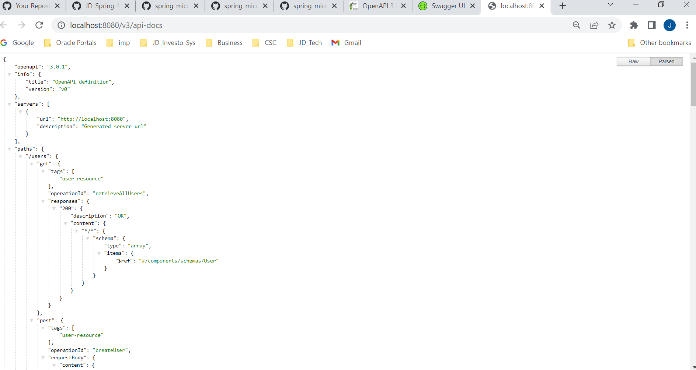

# Spring Micro services Restful Webservices

## What You Will Learn during this Step 01:
- Lets create a simple restful web application using Spring Boot
- Lets run the Spring Boot Application
- There is a lot of magic happening in here!

---
## What You Will Learn during this Step 02:
- Step 02 - Understanding the RESTful Services we would create in this course

- Social Media Application

- User -> Posts


- Retrieve all Users    - GET /users
- Create a User         - POST /users
- Retrieve one User     - GET /users/{id} -> /users/1
- Delete a User         - DELETE /users/{id} -> /users/1


- Retrieve all posts for a User  - GET /users/{id}/posts
- Create a posts for a User      - POST /users/{id}/posts
- Retrieve details of a post     - GET /users/{id}/posts/{post_id}

---
## What You Will Learn during this Step 03:
- Creating a Hello World Service

---
## What You Will Learn during this Step 04:
- Enhancing the Hello World Service to return a Bean

---
## What You Will Learn during this Step 05:
- Quick Review of Spring Boot Auto Configuration and Dispatcher Servlet - What's happening in the background?


---
## What You Will Learn during this Step 06:

- Enhancing the Hello World Service with a Path Variable

---
## What You Will Learn during this Step 07 & 08 & 09 & 10:

- Step 07 - Creating User Bean and User Service
- Step 08 - Implementing GET Methods for User Resource
- Step 09 - Implementing POST Method to create User Resource
- Step 10 - Enhancing POST Method to return correct HTTP Status Code and Location URI


---
## What You Will Learn during this Step 11 & 12 & 13:

- Step 11 - Implementing Exception Handling - 404 Resource Not Found
- Step 12 - Implementing Generic Exception Handling for all Resources
- Step 13 - Exercise : User Post Resource and Exception Handling

---
## What You Will Learn during this Step 14:
- Step 14 - Implementing DELETE Method to delete a User Resource

---
## What You Will Learn during this Step 15:
- Step 15 - Implementing Validations for RESTful Services

* pom.xml ad dependency of spring-boot-starter-validation
```pom.xml
</dependency>
			<dependency>
			<groupId>org.springframework.boot</groupId>
			<artifactId>spring-boot-starter-validation</artifactId>
		</dependency>
```

* output


---
## What You Will Learn during this Step 16:

- Step 16 - Implementing HATEOAS for RESTful Services

* pom.xml add dependency 

```pom.xml
	<dependency>
			<groupId>org.springframework.boot</groupId>
			<artifactId>spring-boot-starter-hateoas</artifactId>
		</dependency>
```
* com.jd.rest.webservices.restfulwebservices.user.UserResource 
```java	
	@GetMapping("/users/{id}")
	public EntityModel<User> retrieveUser(@PathVariable int id) {
		User user = service.findOne(id);

		if (user == null)
			throw new UserNotFoundException("id-" + id);

		EntityModel<User> model = EntityModel.of(user);

		WebMvcLinkBuilder linkToUsers = linkTo(methodOn(this.getClass()).retrieveAllUsers());
		model.add(linkToUsers.withRel("all-users"));

		return model;
	}
```

* output


---
## What You Will Learn during this Step 17 and 18:

- Step 17 - Overview of Advanced RESTful Service Features
- Step 18 - Internationalization for RESTful Services

* com.jd.rest.webservices.restfulwebservices.HelloWorldController
```java
@GetMapping(path = "/hello-world-internationalized")
	public String helloWorldInternationalized(
		//	@RequestHeader(name = "Accept-Language" ,required = false) Locale locale
			) {
		//return "Hello World";
		return messageSource.getMessage("good.morning.message", null, LocaleContextHolder.getLocale());
		
	}
```
* messages.properties
```properties
good.morning.message = Good Morning
```

* messages_fr.properties
```properties
good.morning.message = Bonjour
```

* messages_nl.properties
```properties
good.morning.message = Goede Morgen
```

* output


---
## What You Will Learn during this Step 19:

- Step 19 - Content Negotiation - Implementing Support for XML

* pom.xml add dependency jackson-dataformat-xml

```pom.xml
<dependency>
			<groupId>com.fasterxml.jackson.dataformat</groupId>
			<artifactId>jackson-dataformat-xml</artifactId>
		</dependency>
```
* output


---
## What You Will Learn during this Step 20 and 21 and 22:

- Step 20 - Configuring Auto Generation of Swagger Documentation
- https://springdoc.org/   Open api documentation page
- http://localhost:8080/swagger-ui/index.html  API documentation swagger page
- http://localhost:8080/v3/api-docs Open API rest service

* pom.xml add dependency 
```pom.xml
	<dependency>
			<groupId>org.springdoc</groupId>
			<artifactId>springdoc-openapi-ui</artifactId>
			<version>1.6.7</version>
		</dependency>
```
* Swagger http://localhost:8080/swagger-ui/index.html


* Open API rest service http://localhost:8080/v3/api-docs 



---
## What You Will Learn during this Step 22:

- Monitoring APIs with Spring Boot Actuator

* pom.xml add dependency 
```xml
	<dependency>
	<groupId>org.springframework.boot</groupId>
	<artifactId>spring-boot-starter-actuator</artifactId>
	</dependency>
```

* application.properties
```properties
management.endpoints.web.exposure.include=*
```
* Output http://localhost:8080/actuator


---
## What You Will Learn during this Step 23:

- Visualizing APIs with HAL Explorer

* pom.xml add dependency 
```xml
	<dependency>
		<groupId>org.springframework.data</groupId>
		<artifactId>spring-data-rest-hal-explorer</artifactId>
	</dependency>
```
* Output http://localhost:8080/explorer/index.html#uri=/


---
## What You Will Learn during this Step 24:

- Implementing Static Filtering for RESTful Service we can filter a perticular field to expose
- Two to filter a field
- First way: using @JsonIgnore on the field {private String field3;}
- Second Way : @JsonIgnoreProperties(value = {"field1","field2"}) on the Bean

* com.jd.rest.webservices.restfulwebservices.filtering.SomeBean
```java 
package com.jd.rest.webservices.restfulwebservices.filtering;

import com.fasterxml.jackson.annotation.JsonIgnore;
import com.fasterxml.jackson.annotation.JsonIgnoreProperties;

@JsonIgnoreProperties(value = {"field1","field2"})
public class SomeBean {
	
	private String field1;
	private String field2;
	
	//@JsonIgnore
	private String field3;
	
	
	public SomeBean(String field1, String field2, String field3) {
		super();
		this.field1 = field1;
		this.field2 = field2;
		this.field3 = field3;
	}
	public String getField1() {
		return field1;
	}
	public void setField1(String field1) {
		this.field1 = field1;
	}
	public String getField2() {
		return field2;
	}
	public void setField2(String field2) {
		this.field2 = field2;
	}
	public String getField3() {
		return field3;
	}
	public void setField3(String field3) {
		this.field3 = field3;
	}

}

```
* com.jd.rest.webservices.restfulwebservices.filtering.FilteringController
```java
package com.jd.rest.webservices.restfulwebservices.filtering;

import java.util.Arrays;
import java.util.List;

import org.springframework.web.bind.annotation.GetMapping;
import org.springframework.web.bind.annotation.RestController;

@RestController
public class FilteringController {

	
	@GetMapping("/filtering")
	public SomeBean retrieveSomeBean()
	{
		return new SomeBean("value1","value2","value3");
	}
	
	@GetMapping("/filtering-list")
	public List<SomeBean> retrieveListOfSomeBeans()
	{
		return Arrays.asList(new SomeBean("value1","value2","value3"),new SomeBean("value12","value22","value32"));
	}
}

```
* Output In below image can see field1 and field2 not display


---
## What You Will Learn during this Step 25:

- Implementing Dynamic Filtering for RESTful Service

* com.jd.rest.webservices.restfulwebservices.filtering.SomeBean
```java 
package com.jd.rest.webservices.restfulwebservices.filtering;

import com.fasterxml.jackson.annotation.JsonFilter;
import com.fasterxml.jackson.annotation.JsonIgnore;
import com.fasterxml.jackson.annotation.JsonIgnoreProperties;

@JsonFilter("SomeBeanFilter")
public class SomeBean {
	
	private String field1;
	private String field2;
	
	//@JsonIgnore
	private String field3;
	
	
	public SomeBean(String field1, String field2, String field3) {
		super();
		this.field1 = field1;
		this.field2 = field2;
		this.field3 = field3;
	}
	public String getField1() {
		return field1;
	}
	public void setField1(String field1) {
		this.field1 = field1;
	}
	public String getField2() {
		return field2;
	}
	public void setField2(String field2) {
		this.field2 = field2;
	}
	public String getField3() {
		return field3;
	}
	public void setField3(String field3) {
		this.field3 = field3;
	}

}

```
* com.jd.rest.webservices.restfulwebservices.filtering.FilteringController
```java
package com.jd.rest.webservices.restfulwebservices.filtering;

import java.util.Arrays;
import java.util.List;

import org.springframework.http.converter.json.MappingJacksonValue;
import org.springframework.web.bind.annotation.GetMapping;
import org.springframework.web.bind.annotation.RestController;

import com.fasterxml.jackson.databind.ser.FilterProvider;
import com.fasterxml.jackson.databind.ser.impl.SimpleBeanPropertyFilter;
import com.fasterxml.jackson.databind.ser.impl.SimpleFilterProvider;

@RestController
public class FilteringController {

	// field and field2
	@GetMapping("/filtering")
	public MappingJacksonValue retrieveSomeBean() {
		SomeBean someBean = new SomeBean("value1", "value2", "value3");

		SimpleBeanPropertyFilter filter = SimpleBeanPropertyFilter.filterOutAllExcept("field1", "field2");

		FilterProvider filters = new SimpleFilterProvider().addFilter("SomeBeanFilter", filter);

		MappingJacksonValue mapping = new MappingJacksonValue(someBean);
		mapping.setFilters(filters);
		return mapping;
	}

	// field2 and field3
	@GetMapping("/filtering-list")
	public MappingJacksonValue retrieveListOfSomeBeans() {
		List<SomeBean> list = Arrays.asList(new SomeBean("value1", "value2", "value3"), new SomeBean("value12", "value22", "value32"));
		

		SimpleBeanPropertyFilter filter = SimpleBeanPropertyFilter.filterOutAllExcept("field2", "field3");

		FilterProvider filters = new SimpleFilterProvider().addFilter("SomeBeanFilter", filter);

		MappingJacksonValue mapping = new MappingJacksonValue(list);
		mapping.setFilters(filters);
		
		return mapping;
	}
}

```

* Output


---
## What You Will Learn during this Step 26:

- Versioning RESTful Services - Basic Approach with URIs

* com.jd.rest.webservices.restfulwebservices.versioning.PersonV1
```java
package com.jd.rest.webservices.restfulwebservices.versioning;

public class PersonV1 {
	private String name;
	
	

	public PersonV1() {
		super();
	}

	public PersonV1(String name) {
		super();
		this.name = name;
	}

	public String getName() {
		return name;
	}

	public void setName(String name) {
		this.name = name;
	}

}

```

* com.jd.rest.webservices.restfulwebservices.versioning.PersonV2
```java
package com.jd.rest.webservices.restfulwebservices.versioning;

public class PersonV2 {
	private Name name;

	public PersonV2() {
		super();
	}

	public PersonV2(Name name) {
		super();
		this.name = name;
	}

	public Name getName() {
		return name;
	}

	public void setName(Name name) {
		this.name = name;
	}

}

```

* com.jd.rest.webservices.restfulwebservices.versioning.Name
```java
package com.jd.rest.webservices.restfulwebservices.versioning;

public class Name {
	
	private String firstName;
	private String lastName;
	
	public Name() {
		
	}
	
	public Name(String firstName, String lastName) {
		super();
		this.firstName = firstName;
		this.lastName = lastName;
	}
	public String getFirstName() {
		return firstName;
	}
	public void setFirstName(String firstName) {
		this.firstName = firstName;
	}
	public String getLastName() {
		return lastName;
	}
	public void setLastName(String lastName) {
		this.lastName = lastName;
	}
}

```

* com.jd.rest.webservices.restfulwebservices.versioning.PersonVersioninController
```java
package com.jd.rest.webservices.restfulwebservices.versioning;

import org.springframework.web.bind.annotation.GetMapping;
import org.springframework.web.bind.annotation.RestController;

@RestController
public class PersonVersioninController {
	
	@GetMapping("v1/person")
	public PersonV1 personV1(){
		return new PersonV1("Bob Charlie");
	}
	
	@GetMapping("v2/person")
	public PersonV2 personV2(){
		return new PersonV2(new Name("Bob" ,"Charlie"));
	}

}

```
* Output


---
## What You Will Learn during this Step 27:

- Versioning RESTful Services - Header and Content Negotiation Approaches


* com.jd.rest.webservices.restfulwebservices.versioning.PersonVersioninController
```java
package com.jd.rest.webservices.restfulwebservices.versioning;

import org.springframework.web.bind.annotation.GetMapping;
import org.springframework.web.bind.annotation.RestController;

@RestController
public class PersonVersioninController {
	
	@GetMapping("v1/person")
	public PersonV1 personV1(){
		return new PersonV1("Bob Charlie");
	}
	
	@GetMapping("v2/person")
	public PersonV2 personV2(){
		return new PersonV2(new Name("Bob" ,"Charlie"));
	}

	@GetMapping(value="/person/param" ,  params = "version=1")
	public PersonV1 paramV1(){
		return new PersonV1("Bob Charlie");
	}
	
	@GetMapping(value="/person/param" ,  params = "version=2")
	public PersonV2 paramV2(){
		return new PersonV2(new Name("Bob" ,"Charlie"));
	}

	
	@GetMapping(value="/person/header" ,  headers = "X-API-VERSION=1")
	public PersonV1 headerV1(){
		return new PersonV1("Bob Charlie");
	}
	
	@GetMapping(value="/person/header" ,  headers = "X-API-VERSION=2")
	public PersonV2 headerV2(){
		return new PersonV2(new Name("Bob" ,"Charlie"));
	}
	
	@GetMapping(value="/person/produces" ,  produces  = "application/vnd.company.app-v1+json")
	public PersonV1 producesV1(){
		return new PersonV1("Bob Charlie");
	}
	
	@GetMapping(value="/person/produces" ,  produces  = "application/vnd.company.app-v2+json")
	public PersonV2 producesV2(){
		return new PersonV2(new Name("Bob" ,"Charlie"));
	}
	
}

```
* Output
- Parameter Versioning


- Header Versioning


- Produces Versioning


---


